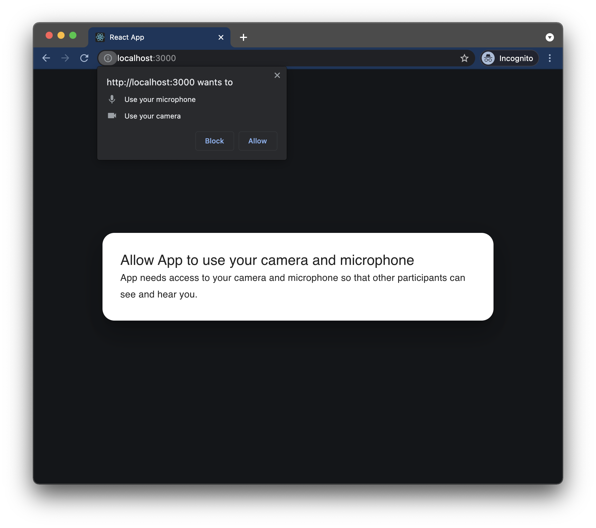
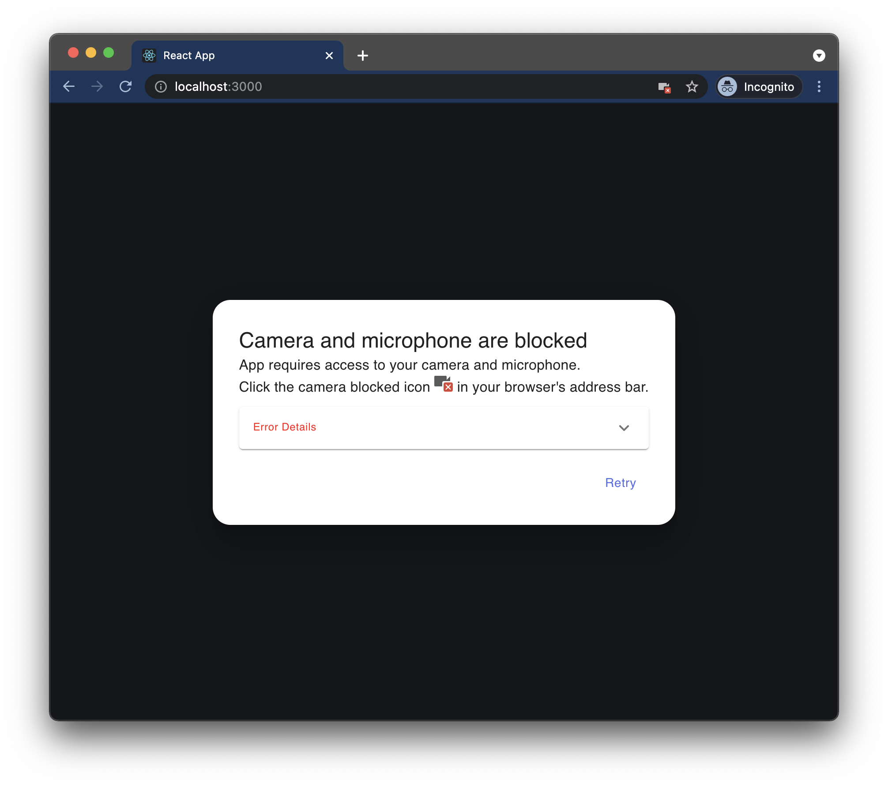
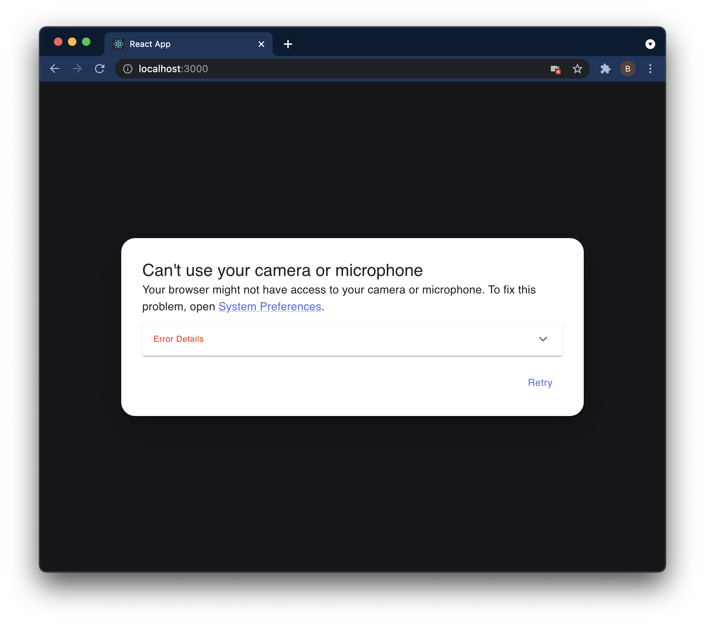

# mic-check

A lightweight package for requesting camera and microphone permissions from the browser with better error handling.

---

<div align="center">



</div>

Note: This library does not include any UI or components and is designed to help you implement those pieces more easily through better error handling. You can, however, use the code included in the [examples](./examples).

## Motivation

One of the most frustrating pieces of building a video chatting website is helping the user set up camera and microphone access. Ideally, you should be able to use the [Permissions API](https://www.w3.org/TR/permissions/) to request media device access, but it isn't yet available on [Safari](https://developer.mozilla.org/en-US/docs/Web/API/Permissions_API#permissions_interface) which accounts for a significant group of users.

[`navigation.mediaDevices.getUserMedia()`](https://developer.mozilla.org/en-US/docs/Web/API/MediaDevices/getUserMedia) is now available on all major browsers, but it returns different errors for the same problems across various browsers (Chrome, Firefox, Edge, Safari) and operating systems (macOS, Windows). Some problems, like the system denying permission, are more common on macOS. Whereas being unable to start the video stream due to another application using it is more Windows specific. Oh, and Firefox is the only one with any [error documentation](https://developer.mozilla.org/en-US/docs/Web/API/MediaDevices/getUserMedia#exceptions) at all.

Handling these errors across browsers and OS's can be difficult, but is crucial to a great user experience. `mic-check` categorizes the major errors and allows you to focus on building a great experience!

## Installation

```
npm install mic-check
```

or

```
yarn add mic-check
```

## Usage

```ts
import {
  MediaPermissionsError,
  MediaPermissionsErrorType,
  requestMediaPermissions
} from 'mic-check';

requestMediaPermissions()
	.then(() => {
		// can successfully access camera and microphone streams
		// DO SOMETHING HERE
	})
	.catch((err: MediaPermissionsError) => {
		const { type, name, message } = err;
		if (type === MediaPermissionsErrorType.SystemPermissionDenied) {
			// browser does not have permission to access camera or microphone
		} else if (type === MediaPermissionsErrorType.UserPermissionDenied) {
			// user didn't allow app to access camera or microphone
		} else if (type === MediaPermissionsErrorType.CouldNotStartVideoSource) {
			// camera is in use by another application (Zoom, Skype) or browser tab (Google Meet, Messenger Video)
			// (mostly Windows specific problem)
		} else {
			// not all error types are handled by this library
		}
	});

```

## Seperate audio/video permission

```ts
import {
  MediaPermissionsError
  MediaPermissionsErrorType,
  requestAudioPermissions,
  requestVideoPermissions,
  requestMediaPermissions
} from 'mic-check';

// Requesting AUDIO permission only:
requestAudioPermissions()
	.then(() => {})
	.catch((err: MediaPermissionsError) => {});

// another way to request AUDIO only...
requestMediaPermissions({audio: true, video: false})
	.then(() => {})
	.catch((err: MediaPermissionsError) => {});

// Requesting VIDEO permission only:
requestVideoPermissions()
	.then(() => {})
	.catch((err: MediaPermissionsError) => {});

// another way to request VIDEO only...
requestMediaPermissions({audio: false, video: true})
	.then(() => {})
	.catch((err: MediaPermissionsError) => {});

```

## Documentation

### requestMediaPermissions() Errors

| Error Type (MediaPermissionsError) | Description                                                                |
| ---------------------------------- | -------------------------------------------------------------------------- |
| SystemPermissionDenied             | Browser does not have access to camera or microphone (common on macOS)     |
| UserPermissionDenied               | User did not grant camera or microphone permissions in the popup           |
| CouldNotStartVideoSource           | Another application or browser tab is using the camera (common on Windows) |
| Generic                            | Everything else                                                            |

### Browser Errors

These are common errors and recommended user actions to resolve them that we have discovered from testing the four major browsers on Windows and macOS.

| Problem                                                                                  | OS (macOS, Windows) | Chrome                                         | Safari                                                                                                                                             | Edge                                           | Firefox                                                                                               | Error Type (MediaPermissionsError) | Recommended User Action                                                               |
| ---------------------------------------------------------------------------------------- | ------------------- | ---------------------------------------------- | -------------------------------------------------------------------------------------------------------------------------------------------------- | ---------------------------------------------- | ----------------------------------------------------------------------------------------------------- | ---------------------------------- | ------------------------------------------------------------------------------------- |
| Browser doesn't have System Preferences access to camera or mic                          | macOS               | NotAllowedError: Permission denied by system   | N/A (Safari always has access)                                                                                                                     | NotAllowedError: Permission denied             | NotFoundError: The object can not be found here.                                                      | SystemPermissionDenied             | Open Mac System Preferences and enable under Camera                                   |
| Browser doesn't have System Preferences access to camera or mic                          | Windows             | NotReadableError: Could not start video source | N/A (Safari not available)                                                                                                                         | NotReadableError: Could not start video source | NotReadableError: Failed to allocate videosource                                                      | N/A                                | Open Windows Settings and enable under Camera                                         |
| User denied permission to access camera or mic                                           | macOS, Windows      | NotAllowedError: Permission denied             | NotAllowedError: The request is not allowed by the user agent or the platform in the current context, possibly because the user denied permission. | NotAllowedError: Permission denied             | NotAllowedError: The request is not allowed by the user agent or the platform in the current context. | UserPermissionDenied               | Manually give permission by clicking on Camera Blocked icon (Safari needs a reprompt) |
| Camera in use by another application (Zoom, Webex) or tab (Google Meet, Messenger Video) | Windows             | NotReadableError: Could not start video source | N/A (Safari not available)                                                                                                                         | NotReadableError: Could not start video source | AbortError: Starting videoinput failed                                                                | CouldNotStartVideoSource           | Turn off other video                                                                  |
| All Other Errors                                                                         |                     |                                                |                                                                                                                                                    |                                                |                                                                                                       | Generic                            |                                                                                       |

## Examples

### React

We have found [Google Meet](https://meet.google.com/) to have one of the best onboarding experiences for camera and microphone permissions. They do a good job of explaining permissions, showing how to allow permissions, and deep linking into System Preferences or Settings when needed. This example, built with React and [Material UI](https://mui.com/), closely copies the Google Meet experience.

You can try it out by going to [`examples/react-example`](./examples/react-example) and running:

```
yarn install && yarn start
```

## Roadmap

<input type="checkbox" checked /> Allow custom constraints for `getUserMedia()`.

<input type="checkbox" disabled /> Handle errors for when there are no camera or microphone devices.

<input type="checkbox" disabled /> Provide support for mobile browsers.

## Dependencies

### [bowser](https://github.com/lancedikson/bowser)

A small, fast and rich-API browser/platform/engine detector for both browser and node.

## Resources

-   [Common getUserMedia() Errors](https://blog.addpipe.com/common-getusermedia-errors/) - A great read explaining various errors when calling getUserMedia() on Firefox vs Chrome. (slightly outdated)
-   [MediaDevices.getUserMedia()](https://developer.mozilla.org/en-US/docs/Web/API/MediaDevices/getUserMedia) - Mozilla's documentation for the reason behind errors when calling getUserMedia().
-   [StackOverflow: reprompt for permissions with getUserMedia() after initial denial](https://stackoverflow.com/a/52701322/6643002) - Some good responses for ways to ask for permission to access camera and microphone.

---

<p align="center">Made with ❤️ at Glimpse</p>
